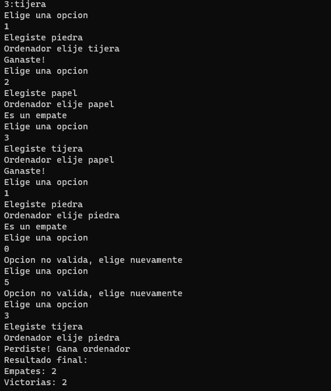

<h1 align="center">
  
Piedra/Papel/Tijera

</h1>

## Introduccion

Este repositorio incluye el códugo para un juego de Piedra/Papel/Tijera en Python.

## Reglas del juego

Es un juego del usuario con el ordenador. El usuario elije por pantalla con el número que corresponde a su elección:
- `1: Piedra`
- `2: Papel`
- `3: Tijera`

Si se elije otra opción se solicita que se intente nuevamente.

Luego se genera un número pseudoaleatorio para el ordenador y se analiza quién gana.

Se sigue jugando, solicitando la opción del usuario hasta que se completan 5 jugadas válidas.

Al final se muestra en pantalla el resultado global para definir si gana el usuario o el ordenador.

